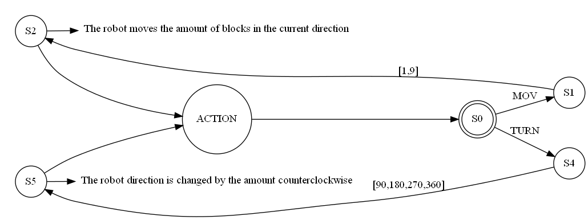

banner image {}
# Deliverable 1: machine state and CPU simulator

## 🚀 Problem description:

A robot language and compiler first needs a CPU that is capable of reading and executing instructions; in order to simulate the functionalities that such robot would have, a the *CPU.py* file found in the */src* folder has the capacity to:

- [x] Open and queue instructions from .asm file
- [x] Understand and execute instructions
- [x] Draw the machine's state on a matrix.

---
## ⭕ Diagram



## 🖋️ Instruction Syntax:
Valid syntax for the **instructions.asm** file

#### **Move instruction:**

"mov" keyword followed by a comma separated value
```
mov,2
```
#### **Turn instruction:**
"turn" keyword followed comma and valid value: (90,180, 270 or 360)
```
turn, 180
```
---

## 📦 Usage:
1. Write instructions into the instructions.asm file with valid syntax
2. Run CPU.py file

## 👟 Run example:
instructions image {}
matrix image {}

# Deliverable 2: Lex analyzer

## 🚀 Problem description:

In order for a human operator to use the robot, a language that is more atuned with regular human speech is necesary. 

In order to achieve this, a series of tokens that are used by a lexer in order to understand some common words is required.

## ✅ Accepted Keywords
Keywords accepted and translated to tokens:

- **NOUN**: robot, gerald
- **BLOCKS**: block, blocks
- **DEGREES**: degrees
- **KIND_WORD**: please, kindly
- **CONJUNCTION**: and
- **ADVERB**: then, subsequently, afterwards, after, next
- **POSITION**: move, advance
- **ORIENTATION**: turn, rotate
- **ANGLE**: 90, 180, 270, 360
- **NUMBER**: [0-9]+
- **DIRECTION**: ahead, forward, left, right, back, up, down.
- **EOL**: \n (*used to separate sentences*)

## 👟 Run example:
```
robot please move 3 blocks ahead and then turn 90 degrees, then move forward 5 blocks and turn 90 degrees
```
accepted {}
```
robot moves 2 blocks quickly
```
rejected {}
# Deliverable 3: YACC grammar
## 🚀 Problem description:

After translating to tokens, the now the job of the parser is to take those tokens and write into the *.asm* file the valid syntax for the CPU to use. 


## ✏️ Valid Sentences
With the tokens already defined, examples of valid sentences are as follows:
```
    * Robot please move 2 blocks ahead
    * Robot please move 3 blocks ahead and then turn 90 degrees, then move 2 blocks
```
Examples of invalid sentences:
```
    * Robot moves 2 blocks
    * Robot moves 2 blocks quickly
    * Move 2 blocks right now
    * Robot  2 blocks moves
    * Moves Robot 2 blocks and turns 89 degrees
```


## 👟 Run example:
Input:
```
robot please move 3 blocks ahead and then turn 90 degrees, then move 2 blocks
```
created file {}
