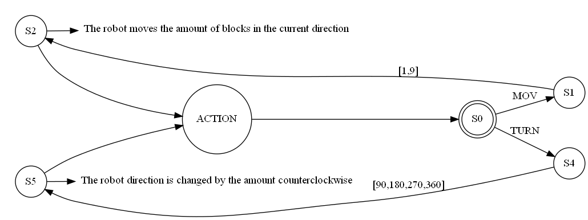
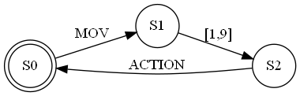
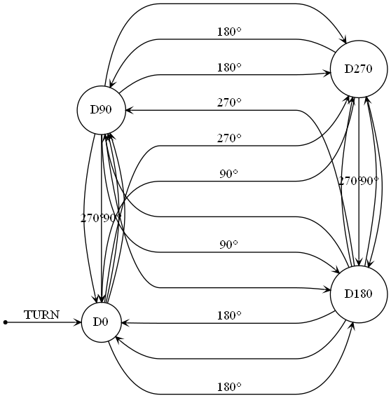

# Deliverable 1: machine state and CPU simulator

Contributors:
- Israel vidal paredes - A01750543
- Javier Eric Hernández - A01635390
- Mariana BusTos Hernández - a01641324 

#### Link to the repository:
https://github.com/BoJavs-svg/RobotComputationalMethods

## Problem description:

A robot language and compiler first needs a CPU that is capable of reading and executing instructions; in order to simulate the functionalities that such robot would have, a the *CPU.py* file found in the */src* folder has the capacity to:

- [x] Open and queue instructions from .asm file
- [x] Understand and execute instructions
- [x] Draw the machine's state on a matrix.

---
## Diagram
First, the robot awaits a comand to be executed, which can be classified as either a *"mov"* comand or a *"turn"* comand:


For a **mov** comand, the robot takes takes the specified amount and executes the action:



For a **turn** comand, the robot keeps track of its own direction in order to turn the correct amount of degrees to end up facing a different direction, represented by the states in the diagram:


## Instruction Syntax:
Valid syntax for the **instructions.asm** file

#### **Move instruction:**

"mov" keyword followed by a comma separated value
```
mov,2
```
#### **Turn instruction:**
"turn" keyword followed comma and valid value: (90,180, 270 or 360)
```
turn, 180
```
---

## Usage:
1. Write instructions into the instructions.asm file with valid syntax
2. Run CPU.py file

## Run example:
```
mov, 3
turn, 90
mov, 2
```


